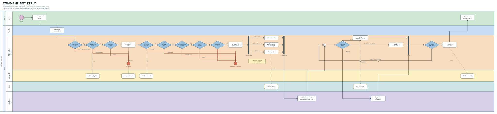

# E2E Flow — ระบบตอบคอมเมนต์อัตโนมัติ (COMMENT_BOT_REPLY)

ภาพรวม end-to-end ของฟีเจอร์ตอบคอมเมนต์อัตโนมัติ เขียนด้วยภาษาธุรกิจ
ใช้สำหรับ **แตกเป็น scenario ทีละชิ้น** เข้า workflow (Stage-1 `get-requirement`)

- **lane = service จริง** ที่กล่องนั้นวิ่งไปหา → รู้ทันทีว่าเทสต้อง mock / seed ตัวไหน
- **บนสุด = client · ล่างสุด = 3rd party** เสมอ
- ข้อความในกล่องเป็นภาษาธุรกิจ ไม่มีชื่อ field / collection / function
- **ข้าวหลามตัด 1 กล่อง = 1 คำถามใช่/ไม่ใช่** แตกได้ 2 ทางเท่านั้น
- **เส้นออกจากข้าวหลามตัด เขียว = ใช่ · แดง = ไม่ใช่** เป็นสีของคำตอบ ไม่ได้แปลว่าดีหรือแย่
- **แถบหนา = แยกทำพร้อมกัน / รวมกลับ** ไม่ใช่การเลือกทางใดทางหนึ่ง
- มีลูปซ้อนกันสองชั้น — ลูปนอกวนบอทของร้านทีละตัว ลูปในวนตรวจผลของแต่ละคำสั่งที่ส่งไป Facebook

---

## Swimlane



สร้างจาก `gen_swimlane.py` — แก้กล่อง/เงื่อนไขในสคริปต์แล้วสั่ง `python3 gen_swimlane.py`
สคริปต์จะสร้างทั้งผังเต็ม และผังของทุก scenario ลงโฟลเดอร์ของแต่ละตัวให้เอง

> **หมายเหตุ** เคยมีผัง mermaid สำรองอยู่ตรงนี้ แต่ลบออกแล้วเพราะ
> mermaid วาด swimlane แบบนี้ไม่ได้ (ดู issue #47) และของเดิมตกยุคจนไม่ตรงกับผังจริง
> ตอนนี้มีแหล่งความจริงแหล่งเดียวคือ `gen_swimlane.py`

---

## Business condition ทั้งหมด 20 ข้อ

ทุกข้อไล่มาจาก `if` / `continue` / `return` จริงในโค้ด ไม่ได้เดาเอา

### ก่อนเข้าบอท

| # | คำถามในผัง | มาจากโค้ด |
|---|---|---|
| 1 | เป็นคอมเมนต์จริงไหม | `validateForComment` — ตัด reaction, ไม่มี comment_id, verb edited |
| 2 | เพจเปิดใช้งานอยู่ไหม | `getByRefIdAndActive` คืน null |
| 3 | คนคอมเมนต์เป็นลูกค้าใช่ไหม | `from.id !== socialNetwork.refId` กันบอทตอบตัวเอง |

### ด่านของบอทแต่ละตัว (อยู่ในลูปนอก)

| # | คำถามในผัง | มาจากโค้ด |
|---|---|---|
| 4 | บอทเป็นของทีมเดียวกับเพจไหม | `socialNetwork.teamId !== bot.teamId` |
| 5 | ตอบคนเดิมซ้ำได้ไหม | `bot.repeat === false` + `LogReplyOnce` |
| 6 | ดูแลโพสต์นี้ไหม | `bot.type === 'SOME_POST'` + `checkMatchingPostId` |
| 7 | มีบอทเฉพาะโพสต์คุมอยู่ไหม | `isNoReplyRepeatSomePost` |
| 8 | คอมเมนต์เป็นข้อความไหม | `findCommentType` แยก MESSAGE ออกจาก IMAGE/STICKER |
| 9 | ตรงคำที่ตั้งให้ตอบไหม | `replyKeywords.some(...)` |
| 10 | มีคำต้องห้ามไหม | `noReplyKeywords.some(...)` |
| 11 | บอทตั้งรับคอมเมนต์แบบนี้ไหม | `bot.reply.includes(commentType)` — เส้นของรูป/สติกเกอร์ ไม่เช็คคำเลย |
| 12 | มีคำสั่งจะส่งไหม | `batchPayload.length === 0` |

### ตอนประกอบคำตอบ

| # | คำถามในผัง | มาจากโค้ด |
|---|---|---|
| 13 | ตอบใต้คอมเมนต์มีทั้งข้อความและรูปไหม | `haveImage ? { name }` + `haveText ? { depends_on }` |
| 14 | แชทเป็นรูปไหม | `responseItemMessage.type === 'TEXT'` |
| 15 | เคยส่งรูปนี้แล้วไหม | `findImageAttachmentId` หาใน Redis |
| 16 | ต้องแนบปุ่มดูรูปเพิ่มไหม | `messages.length > 1 && itemId && messageId` |

### ตอนอ่านผลจาก Facebook (อยู่ในลูปใน)

| # | คำถามในผัง | มาจากโค้ด |
|---|---|---|
| 17 | ยิงคำสั่งออกไปได้ไหม | `if (!result) continue` |
| 18 | คำสั่งนี้รอคำสั่งอื่นอยู่ไหม | `response === null && payload[index].name` |
| 19 | คำสั่งนี้สำเร็จไหม | `response.code < 400` |
| 20 | ไลฟ์ยังไม่จบอยู่ใช่ไหม / รูปที่เคยส่งหมดอายุไหม | `error.code === 1705` · `code 100 subcode 2018074` |

---

## ผังของแต่ละ scenario

ทุก scenario มีผังของตัวเองที่ **ตัดจากผังเต็ม โดยพิกัด สี และเส้นเหมือนเดิมทุกจุด**
เหลือเฉพาะเส้นทางที่ scenario นั้นเดิน

```
Success/01-COMMENT_BOT_REPLY_SUCCESS_1/
├── scenario.html   ← เปิดดูได้ มีผังฝังอยู่ในหน้า
├── flow.svg
└── flow.png
```

เพิ่ม scenario ใหม่ = เติมใน `SCENARIOS` ของ `gen_swimlane.py` แล้วรันใหม่
โฟลเดอร์ scenario.html และผังจะถูกสร้างให้เอง

### ทำไมเก็บเป็น SVG ไม่ใช่ PNG

| | SVG 16 ไฟล์ | PNG 16 ไฟล์ |
|---|---|---|
| ขนาดรวม | 320 KB | 3.1 MB |
| diff ใน PR | เห็นว่าแก้อะไร | เห็นแค่ binary changed |
| สร้างใหม่ | `python3 gen_swimlane.py` จบ | ต้องมี Node + puppeteer |

`` เบราว์เซอร์แสดงได้ปกติอยู่แล้ว

**ถ้าต้องใช้ PNG** เช่นเอาไปแปะ GitHub issue (ซึ่งไม่แสดง SVG) ค่อยแปลงตอนนั้น

```bash
npm i --no-save puppeteer
node -e "const p=require('puppeteer'),path=require('path');(async()=>{const b=await p.launch();const g=await b.newPage();await g.setViewport({width:8160,height:1628,deviceScaleFactor:1.2});await g.goto('file://'+path.resolve(process.argv[1]),{waitUntil:'networkidle0'});await new Promise(r=>setTimeout(r,800));await g.screenshot({path:process.argv[1].replace(/\.svg$/,'.png')});await b.close()})()" swimlane.svg
```

---

## Lane → ต้อง mock / seed อะไรในเทส

ตารางนี้คือเหตุผลที่ lane เป็นชื่อ service — อ่านแถวเดียวรู้เลยว่าเทสแต่ละ level ต้องเตรียมอะไร

| Lane | ระบบจริง | unit | component | api-test |
|---|---|---|---|---|
| 👤 ลูกค้า | คนคอมเมนต์บน Facebook | สร้าง payload คอมเมนต์เอง | สร้าง payload เอง | Bruno ยิง payload คอมเมนต์ |
| 📨 Pub/Sub | GCP Pub/Sub | เรียก service ตรง ๆ | เรียก service ตรง ๆ | ข้ามผ่าน test API (`APP_ENV=dev-api-testing`) |
| ⚙️ live-stream-consumer | ตัวที่เรากำลังเทส | ของจริง | ของจริง | ของจริง (รันใน container) |
| 🗄️ MongoDB | `mod_lsm` | mock repository | Mongo จริงใน compose | seed ผ่าน init-db |
| ⚡ Redis | attachment cache | mock client | Redis จริงใน compose | Redis จริงใน compose |
| 🌐 Facebook Graph API | 3rd party | mock client | stub HTTP | **mountebank** |

---

## จุดที่ตัดเป็น scenario ได้

หลักการยุบ: **ถ้า setup เดียวกันแล้วแค่เปลี่ยน payload ที่ส่งเข้ามา ให้ควบเป็น scenario เดียว**
ไม่งั้นจะต้องสร้าง seed/stub ซ้ำซ้อนเยอะเกินจำเป็น

### Success — เส้นที่ตอบสำเร็จ

| # | scenario | ตัดตรงไหนของ flow | setup ที่ต้องเตรียม |
|---|---|---|---|
| 1 | `SUCCESS_1` | ไลก์ + ตอบใต้คอมเมนต์เป็นข้อความ | บอท 1 ตัว ตั้งไลก์ + คอมเมนต์ข้อความ |
| 2 | `SUCCESS_2` | ตอบใต้คอมเมนต์ **ข้อความ + รูป** รูปขึ้นหลังข้อความ · ใบข้อความได้ผลกลับเป็นค่าว่าง | บอท 1 ตัว ตั้งคอมเมนต์ 2 ชิ้น |
| 3 | `SUCCESS_3` | ทักแชทเป็นรูป **ยิงสองรอบด้วย setup เดียว** รอบแรกอัปรูปใหม่ รอบสองต้องใช้ของใน Redis | บอท 1 ตัว ตั้งแชทเป็นรูป |
| 4 | `SUCCESS_4` | ทักแชทพร้อมปุ่มดูรูปเพิ่ม | บอท 1 ตัว ตั้งแชท 2 ชิ้น + itemId |
| 5 | `SUCCESS_5` | คอมเมนต์เป็น**รูปหรือสติกเกอร์** แล้วบอทติ๊กรับประเภทนั้นไว้ | บอท 1 ตัว ติ๊กรับสติกเกอร์ |
| 6 | `SUCCESS_6` | **บอทหลายตัวเข้าเงื่อนไขพร้อมกัน — เช็คลูปนอก** ผสมเคส 1-4 เข้าด้วยกัน | บอท 3 ตัว |

### Alternative — เส้นที่ไม่ตอบ หรือตอบไม่ครบ

| # | scenario | ตัดตรงไหนของ flow | setup ที่ต้องเตรียม |
|---|---|---|---|
| 1 | `ALTERNATIVE_1` | **ของที่ไม่ควรตอบ** — กดอีโมจิ / แก้คอมเมนต์เดิม / ร้านคอมเมนต์เอง / บอทคนละทีมกับเพจ | เพจเดียว seed บอทปกติ + บอทคนละทีม แล้วยิงหลาย payload |
| 2 | `ALTERNATIVE_2` | เพจถูกปิดใช้งาน หรือไม่เคยผูกไว้ | เพจ activate=false |
| 3 | `ALTERNATIVE_3` | บอทตั้งตอบครั้งเดียว + ลูกค้าคนนี้เคยได้รับแล้ว | บอท repeat=false + มีประวัติเดิม |
| 4 | `ALTERNATIVE_4` | **คอมเมนต์ไม่ผ่านเงื่อนไขคำ** — ไม่ตรงคำที่ตั้ง / มีคำต้องห้าม | บอท 1 ตัว ตั้งทั้งคำที่ตอบและคำต้องห้าม |
| 5 | `ALTERNATIVE_5` | บอททุกโพสต์หลบให้บอทเฉพาะโพสต์ ตอบตัวเดียวไม่ซ้อน | บอท 2 ตัว |
| 6 | `ALTERNATIVE_6` | ไลฟ์ยังไม่จบ ตอบรูปใต้คอมเมนต์ไม่ได้ ปล่อยผ่าน | stub Facebook ตอบ error 1705 |
| 7 | `ALTERNATIVE_7` | รูปในแชทหมดอายุ ส่งใหม่ด้วยลิงก์รูปจริงแล้วสำเร็จ | stub Facebook ตอบ 100/2018074 |
| 8 | `ALTERNATIVE_8` | บอทเปิดอยู่แต่ไม่ได้ตั้งคำตอบไว้ | บอทไม่มี response item |
| 9 | `ALTERNATIVE_9` | ยิงคำสั่งไป Facebook ไม่ออกเลย | stub Facebook ล่ม / token พัง |

## หมายเหตุสำหรับงาน observability ที่จะทำต่อ

จุดที่ควรติด metric สำเร็จ/ไม่สำเร็จ และ map error code อยู่ที่ lane 🌐 Facebook Graph API เป็นหลัก —
กล่อง `Facebook ทำให้ครบไหม` แตกได้ 3 ทาง (สำเร็จ / ข้ามเงียบ / ต้องส่งใหม่)
และเส้น `ข้ามเงียบ ๆ` คือจุดที่ตอนนี้มองไม่เห็นจากภายนอกเลย
