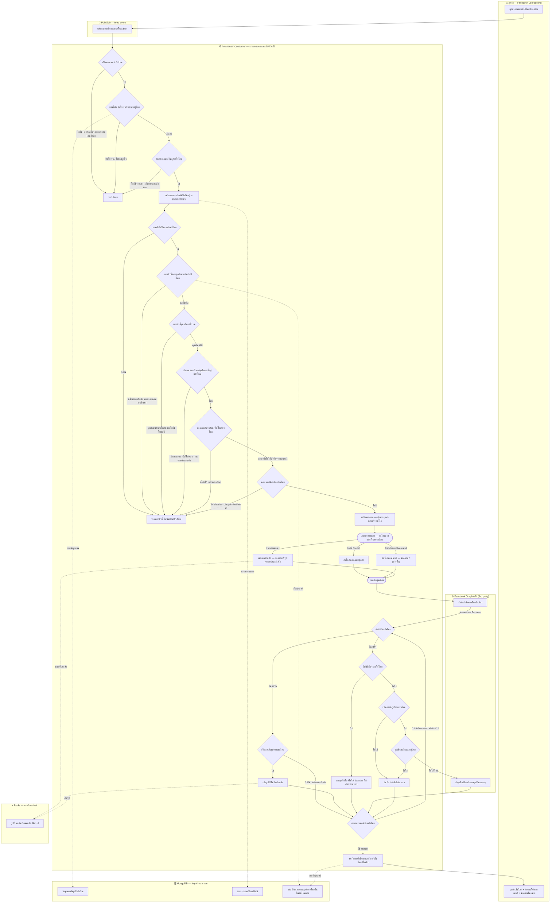

# E2E Flow — ระบบตอบคอมเมนต์อัตโนมัติ (COMMENT_BOT_REPLY)

ภาพรวม end-to-end ของฟีเจอร์ตอบคอมเมนต์อัตโนมัติ เขียนด้วยภาษาธุรกิจ
ใช้สำหรับ **แตกเป็น scenario ทีละชิ้น** เข้า workflow (Stage-1 `get-requirement`)

- **lane = service จริง** ที่กล่องนั้นวิ่งไปหา → รู้ทันทีว่าเทสต้อง mock / seed ตัวไหน
- **บนสุด = client · ล่างสุด = 3rd party** เสมอ
- ข้อความในกล่องเป็นภาษาธุรกิจ ไม่มีชื่อ field / collection / function
- **ข้าวหลามตัด 1 กล่อง = 1 คำถามใช่/ไม่ใช่** แตกได้ 2 ทางเท่านั้น และชื่อกล่องต้องเป็นคำถามจริง ไม่ใช่คำลอย ๆ
- **เส้นออกจากข้าวหลามตัด เขียว = ใช่ · แดง = ไม่ใช่** เป็นสีของคำตอบ ไม่ได้แปลว่าดีหรือแย่
- **ผลจาก Facebook ต้องไล่ตรวจทีละคำสั่ง** — ยิงไปเป็นชุดเดียว แต่ได้ผลกลับมาเป็นรายการ ระบบวนตรวจทีละใบแล้วเช็คว่าครบหรือยังก่อนออกจากลูป
- **แถบหนา = แยกทำพร้อมกัน / รวมกลับ** ไม่ใช่การเลือกทางใดทางหนึ่ง — บอทกดไลก์ ตอบใต้คอมเมนต์ และทักแชท ทำครบทั้งสามในคราวเดียวได้ แล้วแต่ร้านตั้งไว้

---

## Swimlane

lane เรียงบนลงล่าง — บนสุดคือลูกค้า ล่างสุดคือระบบภายนอก · flow วิ่งซ้ายไปขวาและข้ามแถบขึ้นลง

สร้างจาก `gen_swimlane.py` — แก้กล่อง/เงื่อนไขในสคริปต์แล้วรัน `python3 gen_swimlane.py` เพื่อ regenerate

ผังตรรกะแบบ top-down (มุมมองเดียวกัน คนละแกน)

---

## Lane → ต้อง mock / seed อะไรในเทส

ตารางนี้คือเหตุผลที่ lane เป็นชื่อ service — อ่านแถวเดียวรู้เลยว่าเทสแต่ละ level ต้องเตรียมอะไร

| Lane | ระบบจริง | unit | component | api-test |
|---|---|---|---|---|
| 👤 ลูกค้า | คนคอมเมนต์บน Facebook | สร้าง payload คอมเมนต์เอง | สร้าง payload เอง | Bruno ยิง payload คอมเมนต์ |
| 📨 Pub/Sub | GCP Pub/Sub | เรียก service ตรง ๆ | เรียก service ตรง ๆ | ข้ามผ่าน test API (`APP_ENV=dev-api-testing`) |
| ⚙️ live-stream-consumer | ตัวที่เรากำลังเทส | ของจริง | ของจริง | ของจริง (รันใน container) |
| 🗄️ MongoDB | `mod_lsm` | mock repository | Mongo จริงใน compose | seed ผ่าน init-db |
| ⚡ Redis | attachment cache | mock client | Redis จริงใน compose | Redis จริงใน compose |
| 🌐 Facebook Graph API | 3rd party | mock client | stub HTTP | **mountebank** |

---

## จุดที่ตัดเป็น scenario ได้

แต่ละบรรทัดคือ 1 โฟลเดอร์ใต้ `work/Scenario/COMMENT_BOT_REPLY/` — ยังไม่ได้ทำทั้งหมด ทำทีละชิ้น

### Success — เส้นที่ตอบสำเร็จ

| # | scenario | ตัดตรงไหนของ flow | สถานะ |
|---|---|---|---|
| 1 | `COMMENT_BOT_REPLY_SUCCESS_1` | ผ่านทุกด่าน → ไลก์ + ตอบใต้คอมเมนต์เป็นข้อความ + ทักแชทเป็นข้อความ → สำเร็จ | 🟡 Stage-1 เสร็จ |
| 2 | `COMMENT_BOT_REPLY_SUCCESS_2` | ตอบใต้คอมเมนต์เป็น **ข้อความ + รูป** (รูปต้องขึ้นหลังข้อความ) | ⚪ ยังไม่ทำ |
| 3 | `COMMENT_BOT_REPLY_SUCCESS_3` | ทักแชทเป็น **รูปที่ไม่เคยส่ง** → ส่งสำเร็จแล้วเก็บไว้ใช้ซ้ำ | ⚪ ยังไม่ทำ |
| 4 | `COMMENT_BOT_REPLY_SUCCESS_4` | ทักแชทเป็น **รูปที่เคยส่งแล้ว** → ใช้ของเดิมซ้ำ ไม่ต้องอัปใหม่ | ⚪ ยังไม่ทำ |
| 5 | `COMMENT_BOT_REPLY_SUCCESS_5` | ทักแชทพร้อม **ปุ่มดูรูปเพิ่ม** | ⚪ ยังไม่ทำ |
| 6 | `COMMENT_BOT_REPLY_SUCCESS_6` | ร้านมี **บอทหลายตัว** เข้าเงื่อนไขพร้อมกัน → ตอบครบทุกตัว | ⚪ ยังไม่ทำ |

### Alternative — เส้นที่ไม่ตอบ หรือตอบไม่ครบ

| # | scenario | ตัดตรงไหนของ flow | สถานะ |
|---|---|---|---|
| 1 | `COMMENT_BOT_REPLY_ALTERNATIVE_1` | เป็นแค่การกดอีโมจิ หรือแก้คอมเมนต์เดิม → ไม่ตอบ | ⚪ ยังไม่ทำ |
| 2 | `COMMENT_BOT_REPLY_ALTERNATIVE_2` | เพจถูกปิดใช้งาน / ไม่เคยผูกไว้ → ไม่ตอบ | ⚪ ยังไม่ทำ |
| 3 | `COMMENT_BOT_REPLY_ALTERNATIVE_3` | ร้านคอมเมนต์เอง → ไม่ตอบ (กันบอทตอบตัวเอง) | ⚪ ยังไม่ทำ |
| 4 | `COMMENT_BOT_REPLY_ALTERNATIVE_4` | บอทตั้งตอบครั้งเดียว + ลูกค้าคนนี้เคยได้รับแล้ว → ไม่ตอบซ้ำ | ⚪ ยังไม่ทำ |
| 5 | `COMMENT_BOT_REPLY_ALTERNATIVE_5` | คอมเมนต์มีคำต้องห้าม → ไม่ตอบ | ⚪ ยังไม่ทำ |
| 6 | `COMMENT_BOT_REPLY_ALTERNATIVE_6` | คอมเมนต์ไม่ตรงคำที่ตั้งให้ตอบ → ไม่ตอบ | ⚪ ยังไม่ทำ |
| 7 | `COMMENT_BOT_REPLY_ALTERNATIVE_7` | บอททุกโพสต์หลบให้บอทเฉพาะโพสต์ → ตอบตัวเดียว ไม่ซ้อน | ⚪ ยังไม่ทำ |
| 8 | `COMMENT_BOT_REPLY_ALTERNATIVE_8` | ไลฟ์ยังไม่จบ ตอบรูปใต้คอมเมนต์ไม่ได้ → ข้ามเงียบ ๆ ไม่นับว่าพัง | ⚪ ยังไม่ทำ |
| 9 | `COMMENT_BOT_REPLY_ALTERNATIVE_9` | รูปในแชทหมดอายุ → ส่งรูปใหม่อีกครั้งแล้วสำเร็จ | ⚪ ยังไม่ทำ |

---

## หมายเหตุสำหรับงาน observability ที่จะทำต่อ

จุดที่ควรติด metric สำเร็จ/ไม่สำเร็จ และ map error code อยู่ที่ lane 🌐 Facebook Graph API เป็นหลัก —
กล่อง `Facebook ทำให้ครบไหม` แตกได้ 3 ทาง (สำเร็จ / ข้ามเงียบ / ต้องส่งใหม่)
และเส้น `ข้ามเงียบ ๆ` คือจุดที่ตอนนี้มองไม่เห็นจากภายนอกเลย
